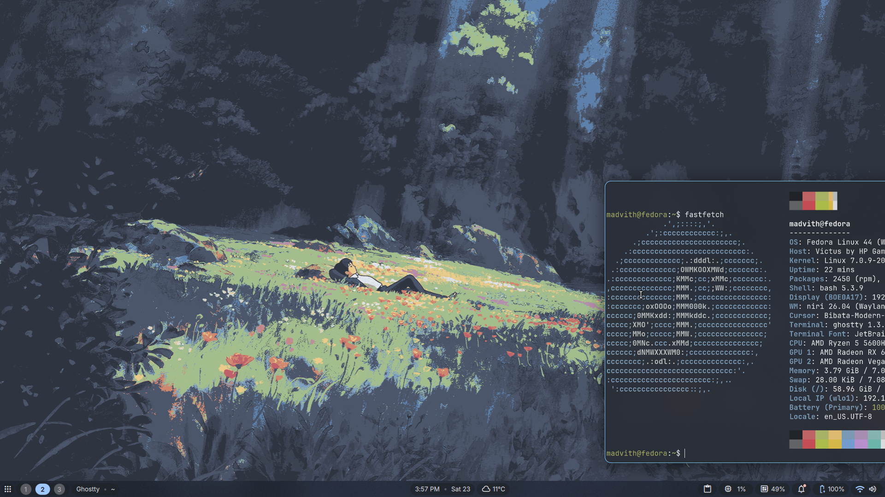
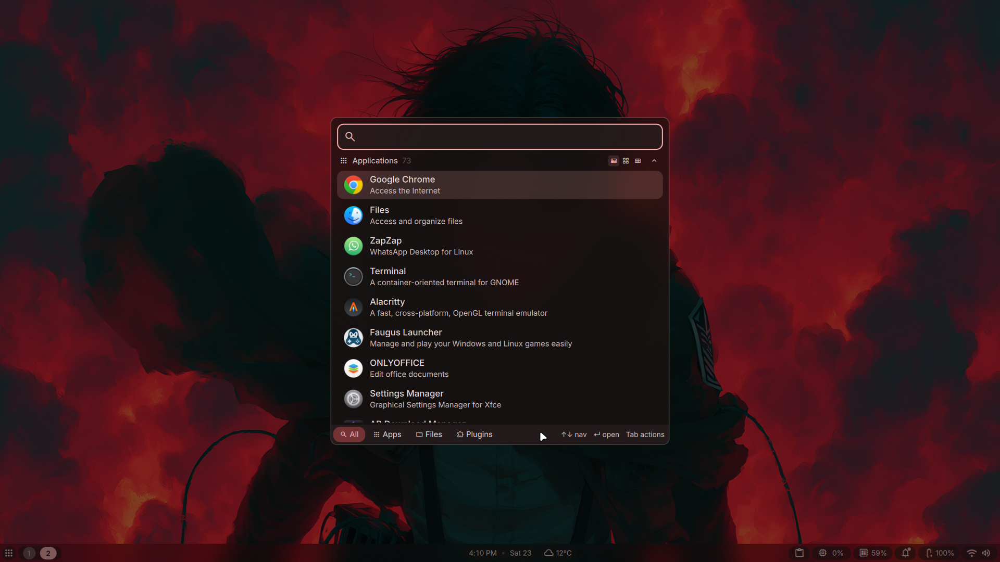

# My niri WM configs (Dank Material Shell)
## 1.3GB idle memory usage !!





## Overview

This repository contains my niri (Wayland compositor) configuration and related components.

## Installation

Choose the instructions for your distribution below.

### Fedora

```bash
sudo dnf copr enable avengemedia/dms
sudo dnf install -y niri dms
systemctl --user enable --now niri.service dms
```

### Arch

```bash
sudo pacman -Syu niri xwayland-satellite xdg-desktop-portal-gnome xdg-desktop-portal-gtk alacritty dms-shell-niri matugen cava qt6-multimedia-ffmpeg
systemctl --user enable --now niri.service dms
```

### Debian / Ubuntu (PPAs)

```bash
sudo add-apt-repository ppa:avengemedia/danklinux
sudo add-apt-repository ppa:avengemedia/dms
sudo apt update
sudo apt install -y niri dms
systemctl --user enable --now niri.service dms
```

## Install this config

Replace `<repo-url>` with the Git URL for this repository.

```bash
git clone <repo-url>
cd <repo-folder>

# create the niri config directory if absent
mkdir -p ~/.config/niri

# copy the config files (preserves directory layout, skips .git)
rsync -av --exclude '.git' ./ ~/.config/niri/

# enable and start services for the current user
systemctl --user daemon-reload
systemctl --user enable --now niri.service dms
```

## Quick start / testing

To start or restart the services for your user session:

```bash
systemctl --user restart niri.service dms
# or start if not running
systemctl --user start niri.service dms
```

Log out and back in (or restart your session) to ensure the compositor picks up the new config.

## Updating the config

```bash
cd <repo-folder>
git pull
rsync -av --exclude '.git' ./ ~/.config/niri/
systemctl --user restart niri.service dms
```

## Notes

- If a command above fails, check that the package names and PPAs match your distribution.
- For Fedora, you may need `dnf-plugins-core` for `dnf copr`.

Enjoy! If you'd like, I can add a sample `git clone` URL or tailor the instructions to your distro/version.
